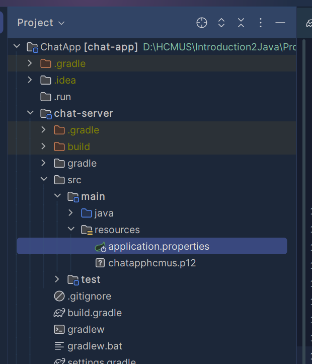
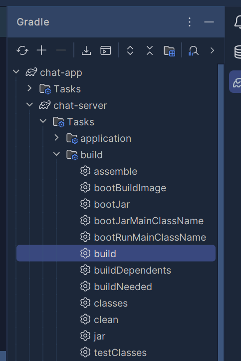
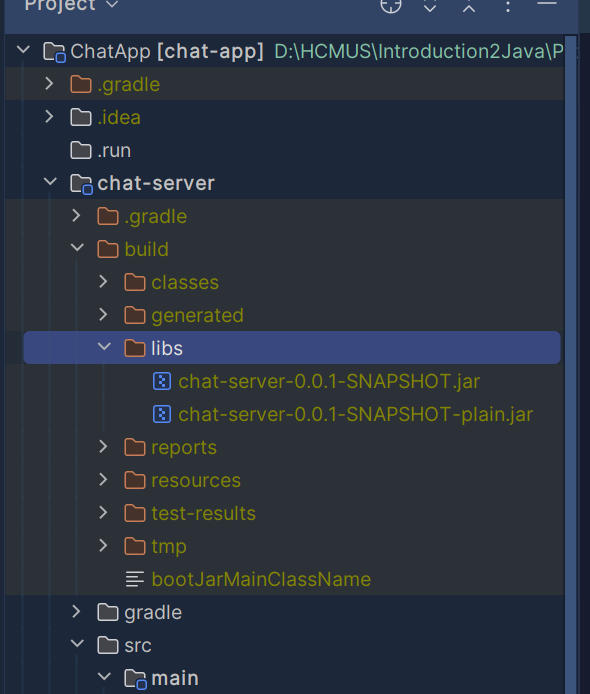

# HCMUS CSC13102 – Java Programming Project
# Chat Application
## 1. Members
- 21127071 - Nguyễn Công Khanh
- 21127142 - Lạc Thiệu Quân
- 21127171 - Trần Gia Thịnh
- 21127174 - Tăng Tường Thoại (Leader).
## 2. Repo information
The repo consist of all three module of the Chat Application: Server, Chat Admin, Chat Client.
> Most of the app logics and functionalities is handling by the server.
> Client only get data and render them on to the screen.
## 3. Running Environment
The chat application is only work at single machine. App testing is done by running multiple instance of the app.
The server must be running along with the client and the running machine need to be installed.
The connection to database of the server need to be config in the application.properties file in the resource folder of 
the chat-server module.

The configuration file location:



Change the following information
```properties
spring.datasource.url=jdbc:postgresql://localhost:5432/chat_app
spring.datasource.username=postgres
spring.datasource.password=123
```
After all configurations are set. We can build the jar file using gradle.
If you are using Intellij then use can use the Integrated Gradle feature to build the jar file.
For example



The result build file is at the libs folder inside build folder.



**All the other module of client and admin are similar to server excepts it doesn't need to be configured.**